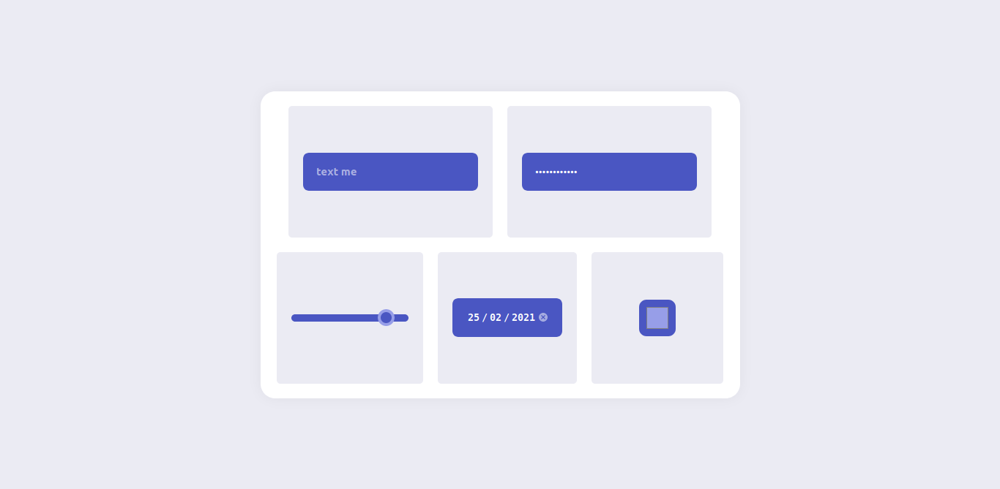

# day-11-in-30-days-of-react 

- in this project I made a simple but beautiful display of different types of input with the idea of reusing components, it didn't work very well but I liked the result, and I also used the framer-motion library to create an input animation

# result image  

